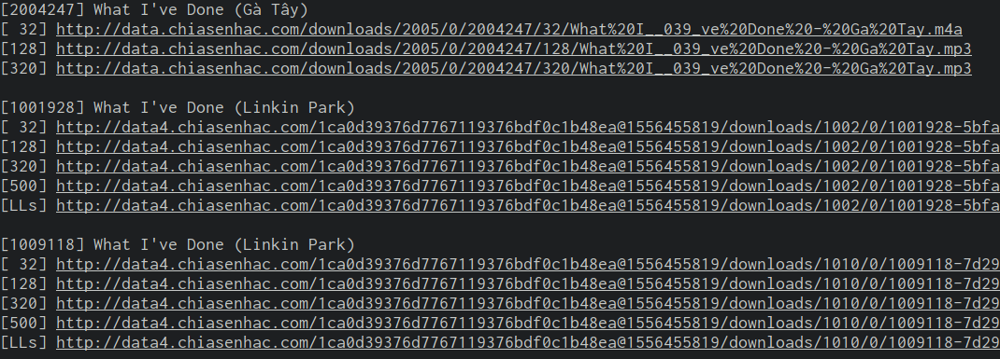

# Description
* A shitty but working API and CLI tools for searching (and maybe more) on chiasenhac.vn
* Please, just use it, don't look at the code

## Build

```sh
$ go get 'github.com/l4rzy/csn-ng/csn'
```

## Usage
* As a library
```go
package main

import (
    "fmt"
    csn "github.com/l4rzy/csn-ng"
    "os"
)

func main() {
    keyword = os.Args[1]
    result, err := csn.SearchNew(csn.OP_MUSIC, keyword, 10)
    if err != nil {
        fmt.Printf("Could not get data: %v\n", err)
        os.Exit(-1)
    }

    for _, r := range result {
        r.Print()
        info, _ := r.GetInfo()
        fmt.Printf("\t[128] %v\n", info.FileURL)
        fmt.Printf("\t[320] %v\n", info.File320URL)
        fmt.Printf("\t[500] %v\n", info.FileM4AURL)
        fmt.Printf("\t[Lossless] %v\n", info.FileLosslessURL)
        fmt.Println("")
    }
}

```

* As a commandline tool
```sh
$ ./csn-ng -album -music love
```
The result should look like this


## License
MIT
